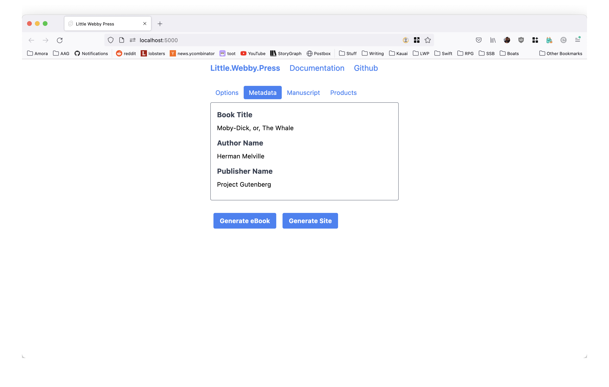

# Case Study: Let's publish Moby Dick

Get the sample project by clicking [this download link](https://little.webby.press/samples/moby-dick.zip). After decompressing the archive, you'll see the manuscript files inside the folder.

They are written in [Markdown](https://markdown.org), which is a popular format for marking up plain-text files. There is one file per chapter, but you can organise your book in as many files as you want.

Open [Little Webby Press](https://little.webby.press) and use the *Load Manuscript Folder* button to open a folder selection dialog. Select the *Moby Dick* folder you just unzipped.


The interface should change and present you with tabs to check out what information Little Webby Press gathered from the manuscript. You can't use Little Webby Press to edit your work, it is not an editor. If you want to change any information or content, you need to edit your manuscript files and load them again. This way your files are always the *source of truth* about your work and there is no risk of the data on your disk not being the same as the data in Little Webby Press.

Let's check each of the tabs. Remember that those tabs are just a reflection of the files you had on disk.

## The Options Tab


The Options Tab provides a quick way to check information about the products you're generating. By default Little Webby Press generates an eBook and a Website.

## The Metadata Tab



This tab shows metadata about the book including author name, publisher, etc.

## The Manuscript Tab


The files that compose your manuscript are listed here in the same order as they will appear in the book. A good way to organise your manuscript is using one file per chapter. This is good for eBooks because some eReaders are underpowered and can't load a whole book in memory without degrading their performance. By using one file per chapter, the final eBook will mimic this organisation internally and the eReaders will need to load just one chapter in memory at a time, making the reading experience much snappier.

## The Products Tab


Both the eBook and Website will be listed here with links to download them.

## The Action Buttons

At the bottom of the interface there are two buttons: *Generate eBook* and *Generate Site*. Clicking them will open the *Products Tab* and start the assembly of the products.


Once the products are ready, you will find links to download them in the *Products Tab*. Clicking the *Generic ePub3 eBook* will download an EPUB3 file which you can read in your favourite eReader application or device.


Clicking on the *Static Website* will download a zip file containing your HTML5 Website for the book. You can unzip it and open the `index.html` file to check it out.


The site also includes a web version of the book, so that readers can read it even without an eReader.


At this point you might be wondering where all the extra information such as cover, marketing blurb, and author bio are comming from. They're comming from a *configuration file* called `Book.toml` that is inside the *Moby Dick* folder.

# The Book Configuration File

This is a special file that tells Little Webby Press all about your book. Let's review the `Book.toml` from *Moby Dick*.

```toml
[metadata]
title = "Moby-Dick, or, The Whale"
date = 2019-08-08T12:00:00Z
identifier = "http://www.gutenberg.org/ebooks/2701"
cover = "images/cover.jpg"

[author]
name = "Herman Melville"
bio = """
Herman Melville, (born August 1, 1819, New York City—died September 28, 1891, New York
 City), American novelist, short-story writer, and poet, best known for his novels of the
  sea, including his masterpiece, Moby Dick (1851).
"""

[publisher]
name = "Project Gutenberg"

[site]
blurb = """
Moby Dick is the story of Captain Ahab's quest to avenge the whale that 'reaped' his leg.
The quest is an obsession and the novel is a diabolical study of how a man becomes a
fanatic.But it is also a hymn to democracy. Bent as the crew is on Ahab's appalling
crusade, it is equally the image of a co-operative community at work: all hands dependent
on all hands, each individual responsible for the security of each.Among the crew is
Ishmael, the novel's narrator, ordinary sailor, and extraordinary reader. Digressive,
allusive, vulgar, transcendent, the story Ishmael tells is above all an education: in the
practice of whaling, in the art of writing. Expanding to equal his 'mighty theme' - not
only the whale but all things sublime - Melville breathes in the world's great literature.
Moby Dick is the greatest novel ever written by an American.
"""

[webmonetization]
endpoint = "$ilp.uphold.com/doesntexist"

[toc]
prefix = "h3"
label = "h1"
match = "first"

[book]
frontmatter = [
  "000-front-matter.md",
]
chapters = [
  "001-loomings.md",
  "002-carpet-bag.md",
  "003-spouter-inn.md",
  "004-counterpane.md",
  "005-breakfast.md",
  "006-street.md",
  "007-chapel.md",
  "008-pulpit.md",
  "009-sermon.md",
  "010-bosom-friend.md",
  "011-nightgown.md",
  "012-biographical.md",
  "013-wheelbarrow.md",
  "014-nantucket.md",
  "015-chowder.md",
  "016-ship.md",
  "017-ramadan.md",
  "018-his-mark.md",
  "019-prophet.md",
  "020-all-astir.md",
  "021-going-aboard.md",
  "022-merry-christmas.md",
  "023-lee-shore.md",
  "024-advocate.md",
  "025-postscript.md",
  "026-knights-squires.md",
  "027-knights-squires.md",
  "028-ahab.md",
  "029-enter-ahab-to-him-stubb.md",
  "030-pipe.md",
  "031-queen-mab.md",
  "032-cetology.md",
  "033-specksnyder.md",
  "034-cabin-table.md",
  "035-mast-head.md",
  "036-quater-deck.md",
  "037-sunset.md",
  "038-dusk.md",
  "039-first-night-watch.md",
  "040-midnight-forecastle.md",
  "041-moby-dick.md",
  "042-whiteness-whale.md",
  "043-hark.md",
  "044-chart.md",
  "045-affidavit.md",
  "046-surmises.md",
  "047-mat-maker.md",
  "048-first-lowering.md",
  "049-hyena.md",
  "050-ahabs-boat-crew-fedallah.md",
  "051-spirit-spout.md",
  "052-albatross.md",
  "053-gam.md",
  "054-town-hos-story.md",
  "055-monstrous-pictures-whales.md",
  "056-less-erroneous-pictures-whales-true-pictures-whaling-scenes.md",
  "057-whales-paint-teeth-wood-sheet-iron-stone-mountains-stars.md",
  "058-brit.md",
  "059-squid.md",
  "060-line.md",
  "061-stubb-kills-whale.md",
  "062-dart.md",
  "063-crotch.md",
  "064-stubbs-supper.md",
  "065-whale-as-dish.md",
  "066-shark-massacre.md",
  "067-cutting-in.md",
  "068-blanket.md",
  "069-funeral.md",
  "070-sphynx.md",
  "071-jeroboams-story.md",
  "072-monkey-rope.md",
  "073-stubb-flask-kill-right-whale.md",
  "074-sperm-whales-head-contrasted-view.md",
  "075-right-whales-head-contrasted-view.md",
  "076-battering-ram.md",
  "077-great-heidelburgh-tun.md",
  "078-cistern-buckets.md",
  "079-prairie.md",
  "080-nut.md",
  "081-pedquod-meets-virgin.md",
  "082-honour-glory-whaling.md",
  "083-jonah-historically-regarded.md",
  "084-pitchpoling.md",
  "085-fountain.md",
  "086-tail.md",
  "087-grand-armada.md",
  "088-schools-schoolmasters.md",
  "089-fast-fish-loose-fish.md",
  "090-heads-or-tails.md",
]

```

This file is written in a special format called [Toml](https://toml.io). Even though it might look a bit complicated at first glance, don worry, you'll be able to handle it just fine. As an author, you're used to much more complex tasks than writing a file in some quirky way.

## The Metadata Section

This section holds general metadata about your book. This is usually what we would consider useful information for *archiving purposes*.

```toml
[metadata]
title = "Moby-Dick, or, The Whale"
date = 2019-08-08T12:00:00Z
identifier = "http://www.gutenberg.org/ebooks/2701"
cover = "images/cover.jpg"
```

The first line:

```toml
[metadata]
```

Is how we start a section. The name of that section is `metadata`. All the items below it belong to the `metadata` section until a new section is created.

Each item is a _key and value pair_, which is a fancy Computer Science jargon to mean that things have a _name_ and a _value_. You have seen this kind of thing many times in your life. Forms you fill have fields with _names_ and _values_ in it. This is very similar, you can think about it as filling a form.

The format is always the _field name_ followed by an _equal sign_ and then the _value for that field_.

```toml
title = "Moby-Dick, or, The Whale"
```

That means that the value for field _title_ is _Moby Dick, or The Whale_. When the value of a field is a text, we enclose it in double quotes.

```toml
date = 2019-08-08T12:00:00Z
```

The _date_ field represents the publication date of the eBook. I know very few of you have ever written a [date in that strange format](https://en.wikipedia.org/wiki/ISO_8601). That format is actually called _ISO 8601_ and it is an international standard for writing dates.

It is `<year>-<month>-<day>T<hour>:<minute>:<seconds>Z`. The _year_ should always be four numbers, and all the other items should be two numbers, so put a leading zero if the value is below ten.


```toml
identifier = "http://www.gutenberg.org/ebooks/2701"
```

This is the unique `identifier` that will be used to _identify_ your book. This can be an ISBN, or any other unique value that is compatible with the platforms you'll distribute your eBook on. A unique URL pointing to your book is a good identifier. In this case, we're pointing it to the original Project Gutemberg page for the book, since the content we're using for the sample came from their project.


```toml
cover = "images/cover.jpg"
```

Inside the sample folder, you'll see an `images` folder that contains all the images used both in the book and on the website for the book. The field `cover` points to a file inside `images/` that is the image to be used as the book cover.

## The Author Section

This section holds the information about the book author. The bio is only shown in the website but the author name is also included in the eBook.

```toml
[author]
name = "Herman Melville"
bio = """
Herman Melville, (born August 1, 1819, New York City—died September 28, 1891, New York
 City), American novelist, short-story writer, and poet, best known for his novels of the
  sea, including his masterpiece, Moby Dick (1851).
"""
```

## The Publisher Section

This is similar to the _Author Section_ but it represents information about the publisher. At the moment, this information is added to the eBook but not the Website.

```toml
[publisher]
name = "Project Gutenberg"
```

## The Site Section

This section contains the _marketing blurb_ used on the Website to help potential readers decide if they want to read your book or not. It is what would go into the _back of a paperback_.

```toml
[site]
blurb = """
Moby Dick is the story of Captain Ahab's quest to avenge the whale that 'reaped' his leg.
The quest is an obsession and the novel is a diabolical study of how a man becomes a
fanatic.But it is also a hymn to democracy. Bent as the crew is on Ahab's appalling
crusade, it is equally the image of a co-operative community at work: all hands dependent
on all hands, each individual responsible for the security of each.Among the crew is
Ishmael, the novel's narrator, ordinary sailor, and extraordinary reader. Digressive,
allusive, vulgar, transcendent, the story Ishmael tells is above all an education: in the
practice of whaling, in the art of writing. Expanding to equal his 'mighty theme' - not
only the whale but all things sublime - Melville breathes in the world's great literature.
Moby Dick is the greatest novel ever written by an American.
"""
```

You can see how it looks in the Website in the screenshot below.


## The WebMonetization Section

[WebMonetization](https://webmonetization.org/) is an exciting new _Web Standard_ that has the potential to revolutionise how creators are funded.

> ### Motivation
>
> The ability to transfer money has been a long-standing omission from the web platform. As a result, the web suffers from a flood of advertising and corrupt business models. Web Monetization provides an open, native, efficient, and automatic way to compensate creators, pay for API calls, and support crucial web infrastructure.
>
> &mdash; _Source: [Web Monetization Website](https://webmonetization.org/)_

The development of Little Webby Press has been originally funded by [Grant For The Web](https://www.grantfortheweb.org/), and WebMonetization has always been a core feature of our little app.

You can create a `[webmonetization]` section and add your [_WebMonetization Payment Pointer_](https://paymentpointers.org/) to enable WebMonetization for the Website. If you do that, then readers who are using WebMonetization-enabled browsers to read your book on the Web will be able to automatically send you some microtransactions.

```toml
[webmonetization]
endpoint = "$ilp.uphold.com/doesntexist"
```

On the Moby Dick sample, the endpoint is pointing to a fictional endpoint.

## The Table Of Contents Section

This section is optional, and is only used when the book is doing something special with the chapter titles. When using Markdown, lines beginning with `#` are titles. The amount of hashes you add before the text represent the _heading level_.

```markdown
# This is a title, with heading 1.

bla bla bla

## This is a subsection with heading 2.

bla bla bla
```

The standard way Little Webby Press generates a _Table Of Contents_ for your book, is by picking all the level 1 and level 2 headers for your book. If a file contains multiple headers of level 1 and 2, they're all placed into the _Table Of Contents_.

The way _Project Gutemberg_ structured the _Markdown_ files for Moby Dick is different though. They used a _level 3_ header as a _hat_. Or at least I learned it was called a _hat_ in my _Desktop Publishing_ class at the university.

These _hats_ are small titles that are placed on top of the chapter actual title (that is why they are hats, they're chapter title's hats).

Each Markdown file in this sample has only one title per file, but that title is preceeded by a little _hat_. To better visualise this, consider this snippet from the beginning of _Chapter 3: Spouter Inn_ from Moby Dick. You can open that file, it is called `003-spouter-inn.md`.

```markdown
### Chapter 3.

# The Spouter-Inn.

Entering that gable-ended Spouter-Inn, you found yourself in a wide, low,
straggling entry with old-fashioned wainscots, reminding one of the bulwarks of
```

So each item in the _Table Of Contents_ should be the _level 3 header_ followed by the _level 1 header_. When reading the eBook these chapter beginnings look really nice:


Since this is not the default way Little Webby Press generates _Table Of Contents_, we had to create a _Table Of Contents Section_ to explain to Little Webby Press how to generate it.

```toml
[toc]
prefix = "h3"
label = "h1"
match = "first"
```

The _Table Of Contents Section_ starts with a `[toc]` because that is easier to type. The `prefix` field represents the _hat_, we're declaring it as `h3` which is _header level 3_. The format used is an [CSS Selector](https://developer.mozilla.org/en-US/docs/Learn/CSS/Building_blocks/Selectors). If you don't want to learn more about _CSS Selector_ here is a handy table to match header levels and CSS selectors:

| Header Level | CSS Selector |
| :---: | :---: |
| 1 | h1 |
| 2 | h2 |
| 3 | h3 |
| 4 | h4 |
| 5 | h5 |
| 6 | h6 |

I don't recommend using header levels above `h3`, they just look like _bold text_.

So, back to the section at hand. The `prefix` is the _hat_. The `label` is the _CSS Selector_ for the _chapter's title_. And the final field `match` can either be `all` or `first`. It tells Little Webby Press if it should look for just the first title in a file, or for multiple titles in a file.

In the case of Moby Dick, there is only one title per file, so the value is `first`. Other books, specially non-fiction books with multiple sections per chapter will use `all`.

If you don't have a _Table Of Contents_ section, Little Webby press will look for all `h1` and `h2` in a given file.

## The Book Section

This is the most important section in the whole `Book.toml` file. It is this section that tells Little Webby Press which Markdown files are used by your book and which is their order.

This section is a bit different than the ones we have seen before because it is not a simple _field_ and _value_ pair. It is a _field_ that holds a _list of values_. Computer Science people enjoy calling it an _Array_ because Computer Science people are notoriously bad at naming things.

```toml
fruits =["apple", "banana", "orange"]
```

Above you can see a list (aka an `Array`) of three fruits. This can also be written in multiple lines, which makes it easier to read.

```toml
fruits = [
  "apple",
  "banana",
  "orange"
]
```

The `[book]` section contains three fields which are _lists of Markdown files_: `frontmatter`, `chapters`, `backmatter`. When a book is assembled, the book _spine_ (which is the way the book content is collated) is composed of the frontmatter, followed by the chapters, and it ends with the backmatter.

The distinction between frontmatter and backmatter and chapters, is that those two sections are not the actual content of the book. They're things like copyright pages, author's notes, acknowledgements, and anything else you want to include in your book that is not the content.

The Moby Dick sample doesn't contain a backmatter, but it contains a frontmatter.

```toml
[book]
frontmatter = [
  "000-front-matter.md",
]
```

In the case of Moby Dick, the frontmatter holds some information about etymology and some extracts about whales.

One important thing to keep in mind is that when an eReader opens an eBook, it usually opens it directly on the first chapter, skipping the frontmatter. Many eReader devices and apps will also not show the frontmatter or backmatter in the _Table Of Contents_. The reader will be able to read them as they flip through the pages, but they might not be listed as they are not strictly part of the book.

The order you place the files inside these lists matter. They are the same order they'll appear in the book.

# Summary

This was a very long chapter, but there was a lot of ground to cover. By now, you should have downloaded the sample for Moby Dick and used Little Webby Press to generate the eBook and the Website. You should also have spent some time looking at the chapter Markdown files to see how they work, and with the _Book configuration File_ understanding it's fields and values.

On the next chapter, we're going to create a book from scratch to show you how to do it. It will be a fake book with fake content, but it will serve as a learning experience on how to use Little Webby Press to create your own books.


